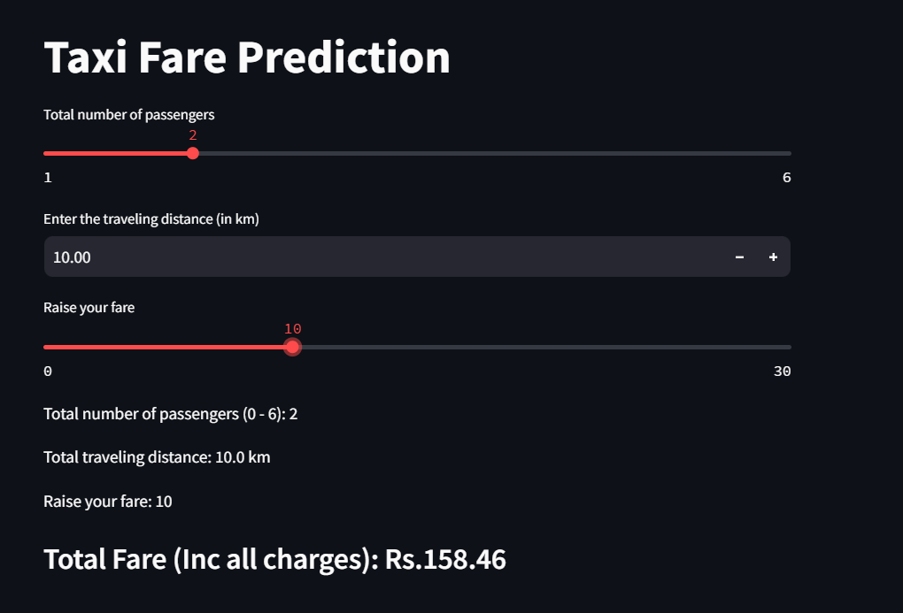

# 🚕 Taxi Fare Prediction using Machine Learning



This project is focused on building a regression model to **predict the actual fare (`act_fare`)** of taxi rides based on multiple factors like the number of passengers, travel distance, and extra charges. The dataset used for this project is the built-in `taxis` dataset available through the Seaborn library.

---

## 📌 Table of Contents

1. [Project Objective](#project-objective)  
2. [Dataset Overview](#dataset-overview)  
3. [Tech Stack and Libraries](#tech-stack-and-libraries)  
4. [Data Preprocessing](#data-preprocessing)  
5. [Exploratory Data Analysis (EDA)](#exploratory-data-analysis-eda)  
6. [Feature Engineering](#feature-engineering)  
7. [Train-Test Split & Feature Scaling](#train-test-split--feature-scaling)  
8. [Model Building](#model-building)  
9. [Model Evaluation](#model-evaluation)  
10. [Pipeline Creation](#pipeline-creation)  
11. [User Prediction Flow](#user-prediction-flow)  
12. [Model Serialization](#model-serialization)  
13. [Future Improvements](#future-improvements)  
14. [Author](#author)

---

## 🎯 Project Objective

The aim of this project is to:

- Clean and prepare the taxi dataset for modeling.
- Analyze the relationship between fare, passengers, distance, and additional charges.
- Train regression models to predict the actual fare of a taxi ride.
- Provide an interactive way for users to input values and receive fare predictions.
- Save and export the trained model for reuse.

---

## 🧾 Dataset Overview

The dataset used in this project is `taxis` from the `Seaborn` library.  
It contains details of taxi rides, including:

| Column      | Description |
|-------------|-------------|
| `passengers` | Number of passengers |
| `distance`   | Distance traveled in KM |
| `fare`       | Base fare (excluding tips) |
| `tip`        | Tip amount |
| `total`      | Total fare including tip |

After preprocessing, we focus on:

- `passengers`
- `distance`
- `act_fare` (renamed from `total`)
- `extra_amt` (calculated as actual fare minus total fare)

Total entries: **6433**  
Data types: **4 numeric columns**

---

## ⚙️ Tech Stack and Libraries

- **Programming Language**: Python 3.x  
- **Libraries Used**:
  - `NumPy` - Numerical computations
  - `Pandas` - Data manipulation
  - `Seaborn` & `Matplotlib` - Data visualization
  - `Scikit-learn` - Machine learning models and utilities
  - `Joblib` - Model serialization

---

## 🧹 Data Preprocessing

Steps taken:

1. Loaded the dataset using `sns.load_dataset("taxis")`
2. Selected relevant columns.
3. Replaced rows where `passengers = 0` with mode value (1).
4. Renamed column `total` to `act_fare`.
5. Created new features:
   - `total_fare = fare + tip`
   - `extra_amt = act_fare - total_fare`
6. Dropped redundant columns: `fare`, `tip`, `total_fare`.

---

## 📊 Exploratory Data Analysis (EDA)

### Summary Statistics
Basic descriptive statistics using `df.describe()` helped understand feature distributions.

### Visualizations:

- **Scatter Plots**:
  - `act_fare vs distance`
  - `act_fare vs extra_amt`
  - `distance vs extra_amt`

- **Bar Plot**:
  - `passengers vs act_fare`

- **Regression Plots**:
  - Trendlines for relationships using `regplot`.

- **Distribution Plots**:
  - KDE-based histograms for each feature to understand spread and skewness.

---

## 🧠 Feature Engineering

Final Features used:
- `passengers` (input)
- `distance` (input)
- `extra_amt` (input)
- `act_fare` (target/output)

---

## 🧪 Train-Test Split & Feature Scaling

### Train-Test Split

- Used `train_test_split()` from Scikit-learn
- Split ratio: **90% training** / **10% testing**
- Random state: 42

### Feature Scaling

- Applied **StandardScaler** to normalize feature values
- Used for both training and testing sets

---

## 🤖 Model Building

### 1. Linear Regression Model

- Trained using `LinearRegression()` from Scikit-learn
- Achieved an **R² Score: 0.7773**

### 2. Decision Tree Regressor

- Trained using `DecisionTreeRegressor()`
- (Note: R² Score displayed is from Linear Regression only)

---

## 📈 Model Evaluation

Metric Used: **R² Score**

- R² Score indicates that **77.7% of the variance** in actual fare is explained by the model.
- While decent, improvements can be made with more complex models or additional features.

---

## 🔗 Pipeline Creation

Used `Pipeline()` to automate preprocessing and model training:

```python
pipe = Pipeline([
    ('Scaler', StandardScaler()),
    ('model', LinearRegression())
])
pipe.fit(X_train, y_train)
```

- Simplifies prediction and deployment
- Handles scaling and modeling together

---

## 💡 User Prediction Flow

```python
passengers = float(input("Enter total no of passengers: "))
distance = float(input("Enter your distance (KM): "))
extra_amt = float(input("Enter your extra_amt: "))
value_input = np.array([passengers, distance, extra_amt]).reshape(1, 3)
pred = model.predict(value_input)
print(f"Your total fare is: {pred}")
```

> Example Output:
```
Your total fare is: 215.45
```

---

## 💾 Model Serialization

The trained model is saved using Joblib:

```python
import joblib
joblib.dump(model, 'model.pkl')
```

- This `.pkl` file can be used later for predictions without retraining the model.

---

## 🚀 Future Improvements

- Add hyperparameter tuning (GridSearchCV or RandomizedSearchCV)
- Train more advanced models: Random Forest, XGBoost, or Gradient Boosting
- Feature expansion (day/night flag, weather, location zones)
- Model deployment using Flask, Streamlit, or FastAPI
- Create a web interface for user input and visualization

---

## 👨‍💻 Author

**Developed by:** [Saikat Bhattacharjee]  
**GitHub:** [github.com/username](https://github.com/saikatb2000)

---
